# How to optimize DGEMM on x86 CPU platforms

General matrix/matrix multiplication (GEMM) is a core routine of many popular algorithms. On modern computing platforms with hierarchical memory architecture, it is typically possible that we can reach near-optimal performance for GEMM. For example, on most x86 CPUs, Intel MKL, as well as other well-known BLAS implementations including OpenBLAS and BLIS, can provide >90% of the peak performance for GEMM. On the GPU side, cuBLAS, provided by NVIDIA, can also provide near-optimal performance for GEMM. Though optimizing serial implementation of GEMM on x86 platforms is never a new topic, a tutorial discussing optimizing GEMM on x86 platforms with AVX512 instructions is missing among existing learning resources online. Additionally, with the increasing on data width compared between AVX512 and its predecessors AVX2, AVX, SSE4 and etc, the gap between the peak computational capability and the memory bandwidth continues growing. This simultaneously gives rise of the requirement on programmers to design more delicate prefetching schemes in order to hide the memory latency. Comparing with existed turials, ours is the first one which not only touches the implementation leaveraging AVX512 instructions, and provides step-wise optimization with prefetching strategies as well. The DGEMM implementation eventually reaches comparable performance to Intel MKL.

# Hardware platforms and software configurations

* We require a CPU with the CPU flag ```avx512f``` to run all test cases in this tutorial. This can be checked on terminal using the command: ```lscpu | grep "avx512f"```. 
* The experimental data shown are collected on an Intel Xeon W-2255 CPU (2 AVX512 units, base frequency 3.7 GHz, turbo boost frequency running AVX512 instructions on a single core: 4.0 GHz). This workstation is equipped with 4X8GB=32GB DRAM at 2933 GHz. The theoretical peak performance on a single core is: 2(FMA)*2(AVX512 Units)*512(data with)/64(bit of a fp64 number)*4 GHz = 128 GFLOPS.
* We compiled the program with ```gcc 7.3.0``` under Ubuntu 18.04.5 LTS.
* Intel MKL version: oneMKL 2021.1 beta.

# How to run
Just three steps.
* We first modify the path of MKL in ```Makefile```.
* Second, type in ```make``` to compile. A binary executable ```dgemm_x86``` will be generated.
* Third, run the binary using ```./dgemm_x86 [kernel_number]```, where ```kernel_number``` selects the kernel for benchmark. ```0``` represents Intel MKL and ```1-19``` represent 19 kernels demonstrating the optimizing strategies.

# Step-wise Optimizations

Here we takes the column-major implemetation for DGEMM.

## Kernel 1 (naive version)
[source code](https://github.com/yzhaiustc/GEMM/blob/master/include/kernel1.h)

Kernel 1 is the most naive implementation of DGEMM.

## Kernel 2 (register re-use)
[source code](https://github.com/yzhaiustc/GEMM/blob/master/include/kernel2.h)

Observing the innermost loop in [kernel1](https://github.com/yzhaiustc/GEMM/blob/master/include/kernel1.h), ```C(i,j)``` is irrelevant to the innermost loop index ```k```, therefore, one can load it into the register before entering the k-loop to avoid unnecessary memory access. 

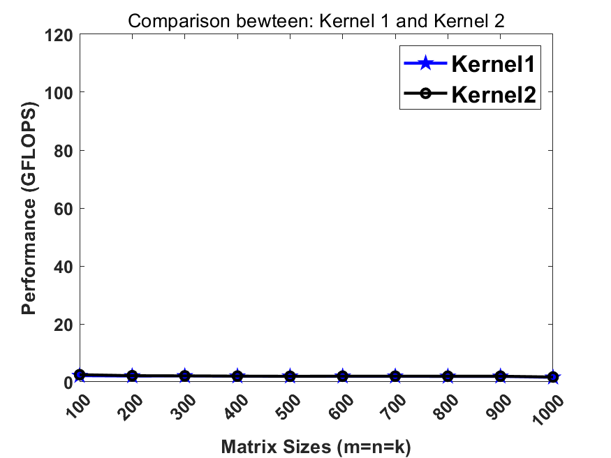

## Kernel 3 (2x2 register blocking)
[source code](https://github.com/yzhaiustc/GEMM/blob/master/include/kernel3.h)

Since matrix multiplication is an algorithm at the complexity order of N^3, one should basically re-use the data at register/cache levels to improve the performance. In [kernel2](https://github.com/yzhaiustc/GEMM/blob/master/include/kernel2.h), we cached a C element in register but failed to re-use the data on matrix A and B at the register level. Now we update the whole 2x2 block of C matrix by loading a 2x1 slice of A and an 1x2 slice of B. Then we conduct an outer-product rank-1 update on the 2x2 C block. This significantly improves the performance compared to the previous step.


## Kernel 4 (4x4 register blocking)

[source code](https://github.com/yzhaiustc/GEMM/blob/master/include/kernel4.h)

Now we more aggresively leverage the register-blocking strategy. We update on an 4x4 C block each time. The performance further improves.

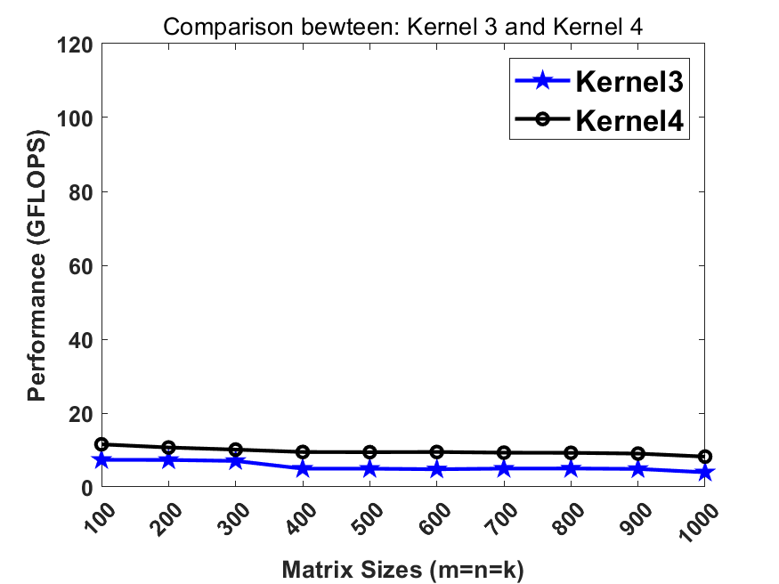

## Kernel 5 (Kernel 4 + AVX2)

[source code](https://github.com/yzhaiustc/GEMM/blob/master/include/kernel5.h)

Instead of processing data with scalar instructions, now we process data using Single Instruction Multiple Data (SIMD) instructions. An AVX2 instruction, whose data width is 256-bit, can process 4 fp64 elements at a lane.

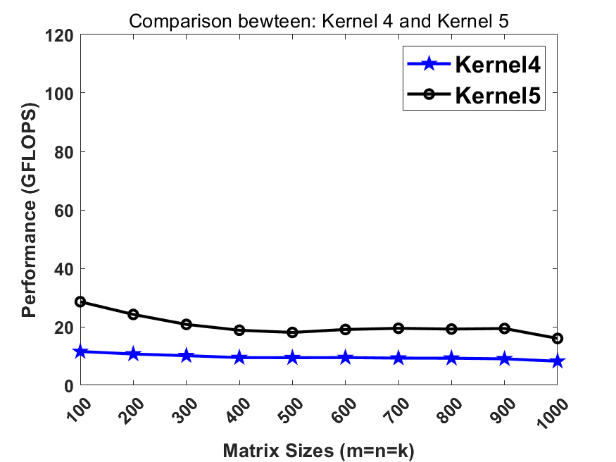

## Kernel 6 (Kernel 5 + loop unrolling x 4)

[source code](https://github.com/yzhaiustc/GEMM/blob/master/include/kernel6.h)

We unroll the loop by 4 folds. This step slightly improves the performance.

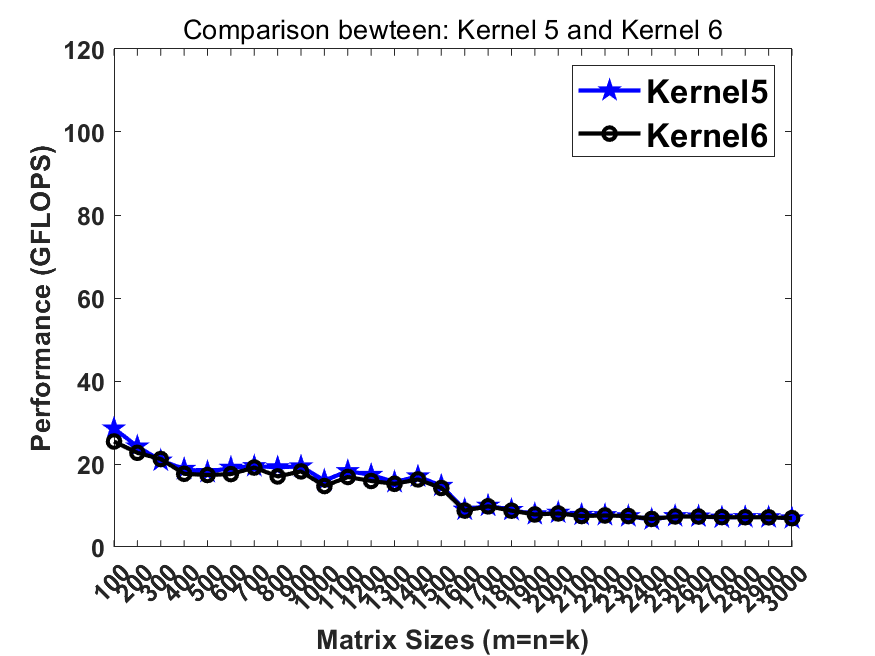

## Kernel 7 (8x4 kernel + AVX2 + loop unrolling x 4)

[source code](https://github.com/yzhaiustc/GEMM/blob/master/include/kernel7.h)

We changed the previous [kernel](https://github.com/yzhaiustc/GEMM/blob/master/include/kernel6.h) from 4x4 to the current 8x4 so that we obtain a better utilization on all 256-bit YMM registers (16 YMMs on SNB/HSW/BRW and 32 YMM/ZMM on SKL/CSL).

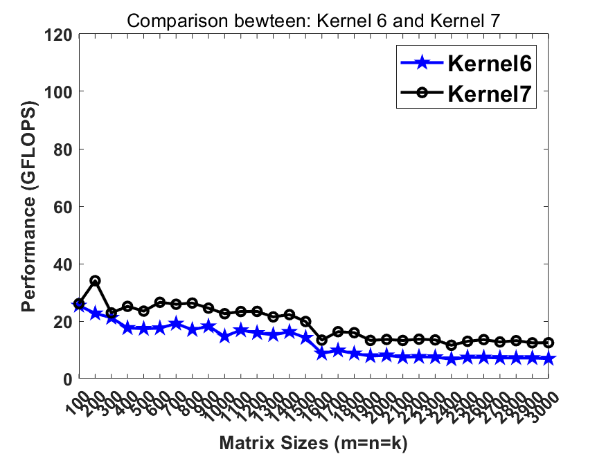

## Kernel 8 (Kernel 7 + cache blocking)

[source code](https://github.com/yzhaiustc/GEMM/blob/master/include/kernel8.h)

We notice that the performance around 30 GFLOPS cannot be maintained when data cannot be held in cache. Therefore, we introduce cache blocking to maintain the good performance when matrix sizes are small.

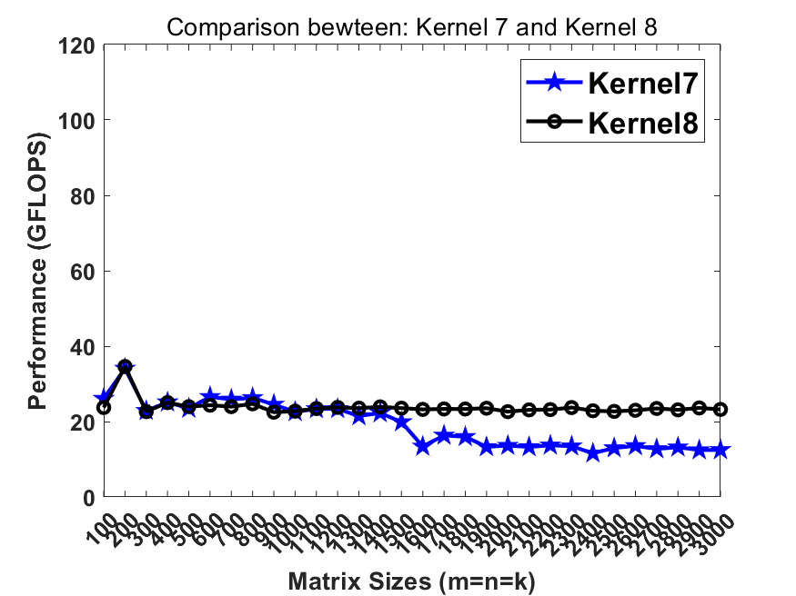

## Kernel 9 (Kernel 8 + packing)

[source code](https://github.com/yzhaiustc/GEMM/blob/master/include/kernel9.h)

To avoid the TLB miss when accessing the cache blocks, we pack the data blocks into continous memory before loading them. This strategy boosts the performance.

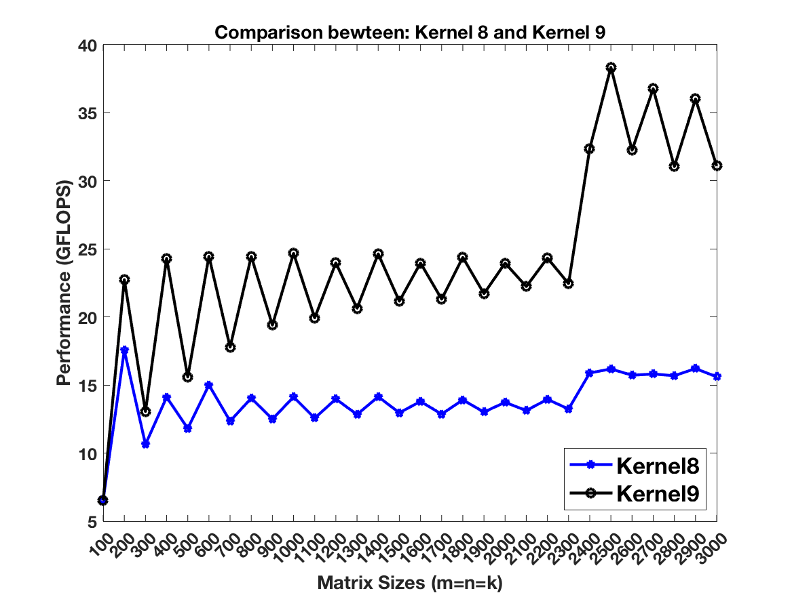

## Kernel 10 (24x8 kernel + AVX512 + blocking + packing)

[source code](https://github.com/yzhaiustc/GEMM/blob/master/include/kernel10.h)

We update [kernel9](https://github.com/yzhaiustc/GEMM/blob/master/include/kernel9.h) with a larger micro kernel (24x8 instead of 8x4) and wider data width (AVX512 instead of AVX2). All other strategies maintain.

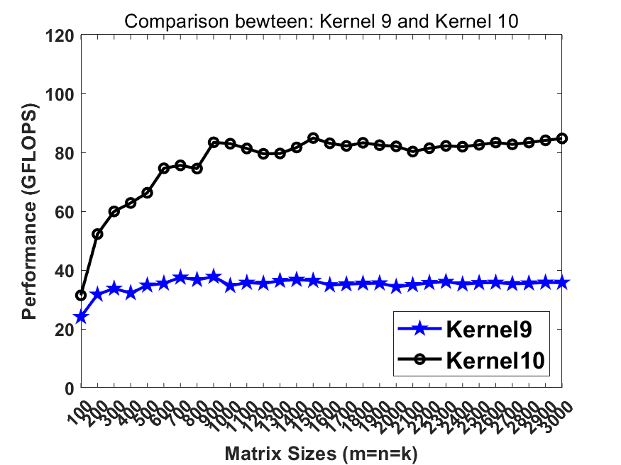

## Kernel 11 (Kernel 10 + exchange M and N loop)

[source code](https://github.com/yzhaiustc/GEMM/blob/master/include/kernel11.h)

In the previous step, we were basically re-using the KcXNc B slice at the L3 cache level and the McXKc pannel of A at the L2 cache Level. The KcX4 slice of B is to be re-used at the L1 cache level. Since the L3 cache is typicall very large, we intend to choose a large blocking size for Nc. In practical, I choose not to blocking for Nc (Nc = infinity). Therefore, I exchanged the m&n loop in [kernel10]((https://github.com/yzhaiustc/GEMM/blob/master/include/kernel10.h)) to make the Nc from 96 to inf.

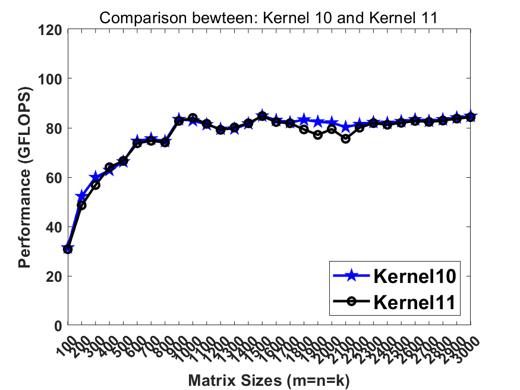

## Kernel 12 (Kernel 11 + more delicate edge case)

[source code](https://github.com/yzhaiustc/GEMM/blob/master/include/kernel12.h)

The zig-zag performance plot of [kernel11](https://github.com/yzhaiustc/GEMM/blob/master/include/kernel11.h) is due to the performance gap between 24x8 kernel and the kernels to deal with the edge cases. When the size of input matrices cannot be divisible by the block sizes (Mc=192,Nc=96 and Kc=384), a significant portion of calculations fall into the less efficient kernels (8x4,1x4 and 1x1) to deal with the edge cases.

It is unwise that we send the data into edge kernels when a input dimension is not divisible by Mc/Nc/Kc because these three parameters are relatively much larger than Mr(24) and Nr(8). In this step, we slight modify the packing routines to fuse the edge kernels into the packing routing. The computations degrade to edge kernels only when input sizes are not divisible by the small Mr(24) and Nr(8). This smooths the performance plot and improves the performance.


## Kernel 13 (Kernel 12 + discontinous packing on B)

[source code](https://github.com/yzhaiustc/GEMM/blob/master/include/kernel13.h)

Previously in [kernel12](https://github.com/yzhaiustc/GEMM/blob/master/include/kernel12.h) we pack the matrix B into totally continous memory. Recalling that the L2 cache contains multiple cache line buffers so that the L2 hardware prefetcher can prefetch the data from lower memory hierarchy. In this step, breaking the continous memory access in B can benefit the L2 hw prefetcher so that the memory latency can be further hidden.

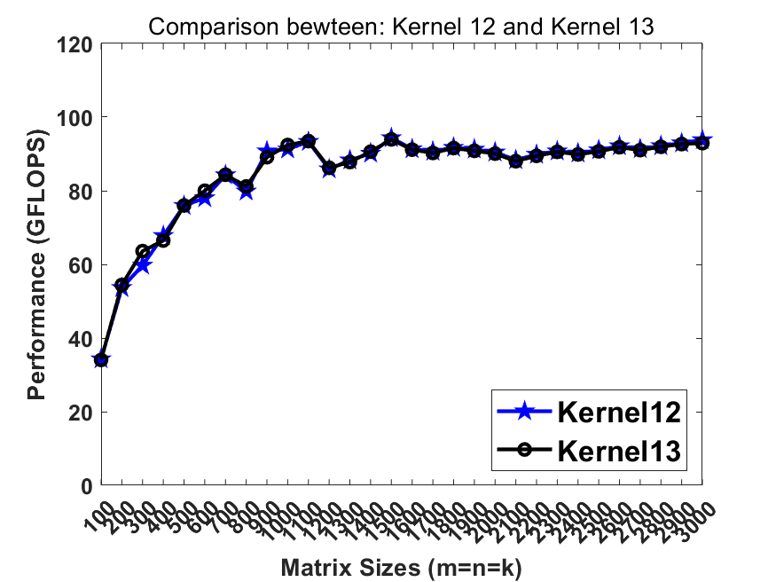

## Kernel 14 (Kernel 13: from instrinsics to inline ASM )

[source code](https://github.com/yzhaiustc/GEMM/blob/master/include/kernel14.h)

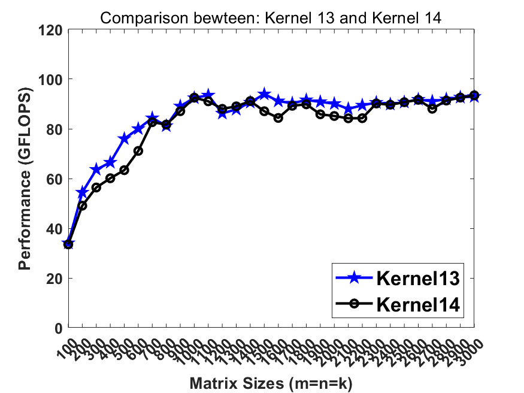

## Kernel 15 (Kernel 14 + changing the whole macro kernel into inline ASM)

[source code](https://github.com/yzhaiustc/GEMM/blob/master/include/kernel15.h)

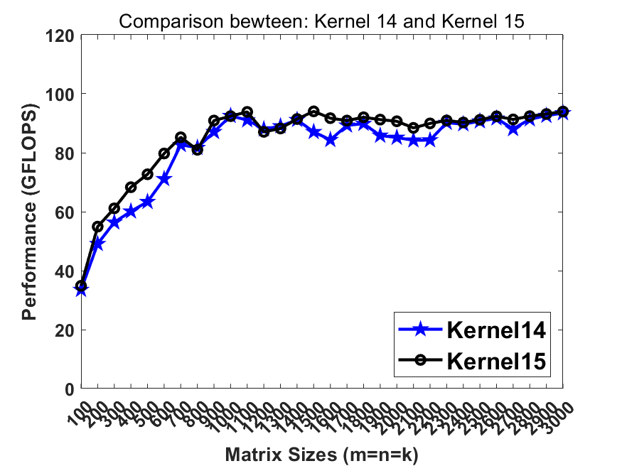

## Kernel 16 (Kernel 15 + software prefetching on A)

[source code](https://github.com/yzhaiustc/GEMM/blob/master/include/kernel16.h)


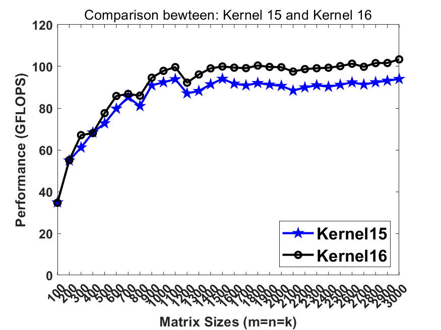

## Kernel 17 (Kernel 16 + software prefetching on B)

[source code](https://github.com/yzhaiustc/GEMM/blob/master/include/kernel17.h)


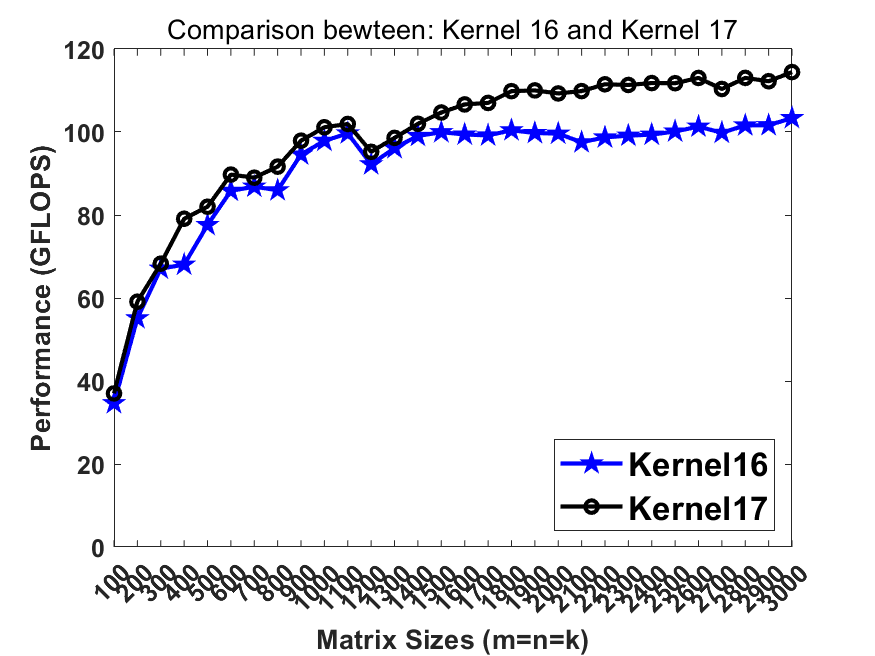


## Kernel 18 (Kernel 17 + software prefetching on C)

[source code](https://github.com/yzhaiustc/GEMM/blob/master/include/kernel18.h)


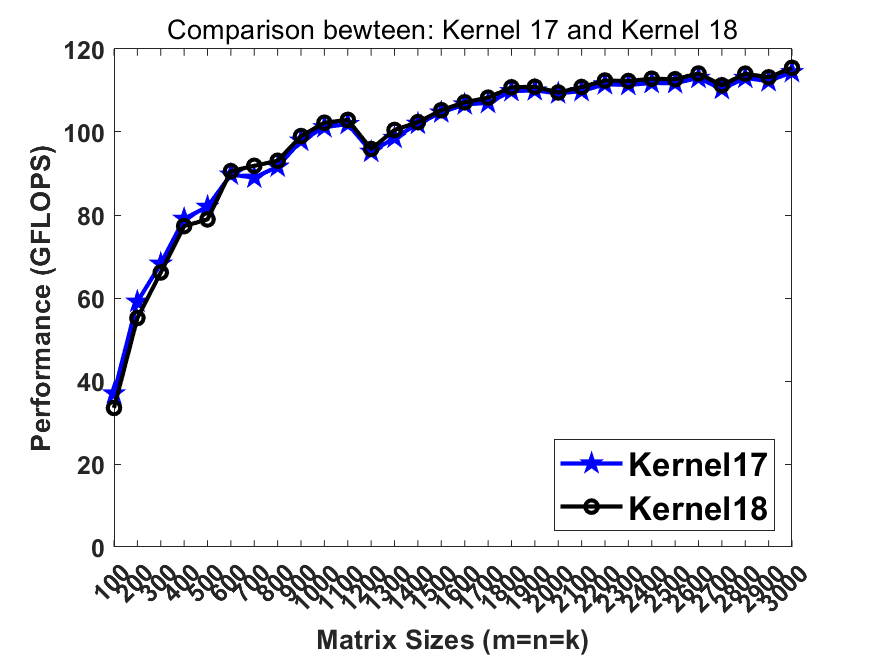

## Kernel 19 (Kernel 18 + fine-tuned matrix scaling routine on C)

[source code](https://github.com/yzhaiustc/GEMM/blob/master/include/kernel18.h)


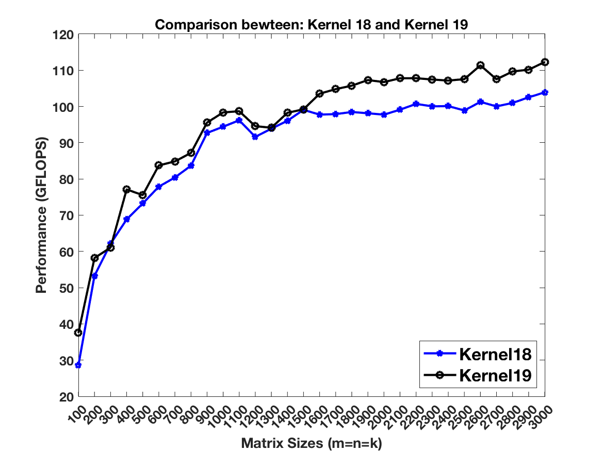

## Kernel 19 comparison against Intel MKL

